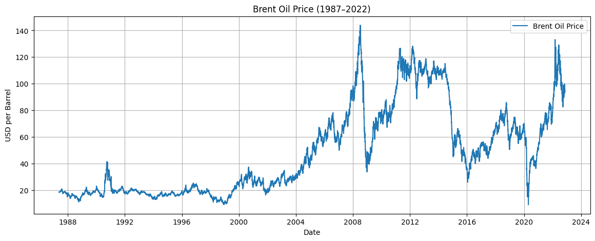
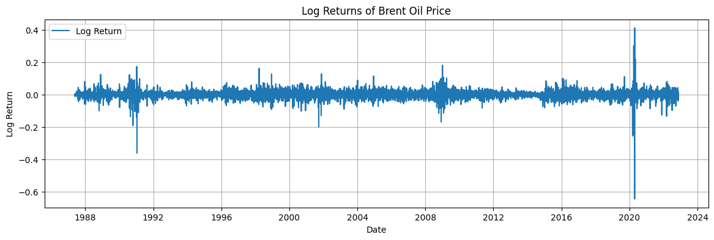

# Change Point Analysis on Brent Oil Prices

## 📈 Project Overview

This project applies **Bayesian Change Point Detection** to analyze historical **Brent oil prices** from 1987 to 2022, identifying significant structural shifts in price behavior. The goal is to link these shifts to major geopolitical and economic events such as OPEC decisions, wars, sanctions, and pandemics.

This project is developed as part of the **10 Academy - Week 10 AI Mastery Challenge**.

---

## 🧠 Objectives

- Detect structural breaks in the Brent oil price time series
- Link changes to real-world geopolitical/economic events
- Quantify the impact of major events using Bayesian inference
- Provide actionable insights for investors, policymakers, and analysts

---

## 🔍 Data Sources

- **Brent Oil Prices** (`data/brent_oil_prices.csv`): Daily prices from May 1987 to September 2022
- **Event Dataset** (`data/events_data.csv`): Structured list of major political/economic events affecting oil prices

---

## 📊 Project Structure

```bash
change-point-oil-prices/
│
├── data/                      # Raw and structured datasets
│   ├── brentoilprices.csv
│   └── events_data.csv
│
├── notebooks/                # EDA and modeling notebooks
│   ├── 01_eda_and_stationarity.ipynb
│   └── 02_bayesian_change_point.ipynb
│
├── src/                      # Python scripts for model and data loading
│   ├── data_loader.py
│   └── change_point_model.py
│
├── reports/                  # Reporting materials
│   └── interim_report.md
│
├── README.md
├── requirements.txt
└── .gitignore

## 📈 Visual Exploration of Brent Oil Prices

### Raw Brent Oil Price Time Series


### Log Returns of Brent Oil Price


🛠️ Technologies Used
Python

Pandas, NumPy

Matplotlib, Seaborn

PyMC3, ArviZ

Statsmodels

Jupyter Notebooks

🚀 How to Run

1.Clone the repository:
git clone https://github.com/your-username/change-point-oil-prices.git
cd change-point-oil-prices

2.Install dependencies:
pip install -r requirements.txt

3.Open notebooks:
jupyter notebook notebooks/01_eda_and_stationarity.ipynb

📌 Status
This repository is currently in the Interim Phase, covering:

Planned data science workflow

Event dataset compilation

EDA and time series diagnostics

📚 References
Bayesian Change Point Detection with PyMC3

Data Science Workflow

Markov Chain Monte Carlo

🏆 Credits
Developed by Barkilign Mulatu — AI Fellow @ 10 Academy
Supervised by Mahlet, Rediet, Kerod, and Rehmet